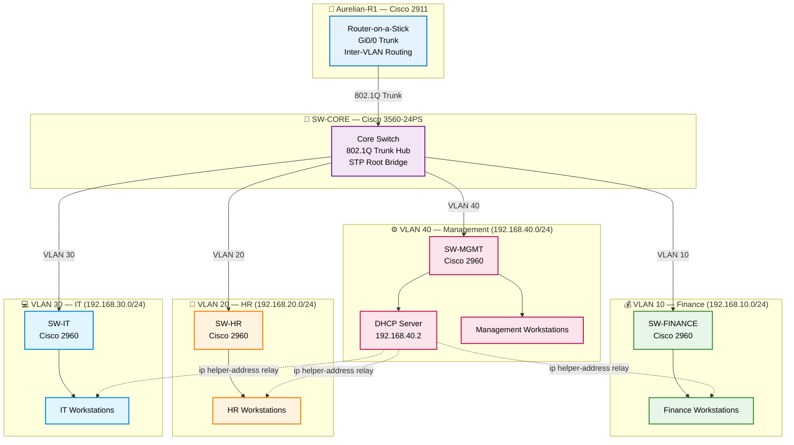

# Aurelian Financial Group — Enterprise Network Case Study

> **Cisco Packet Tracer · VLAN Segmentation · Router-on-a-Stick · DHCP Relay · Tier 2/3 Troubleshooting**

[](https://rahatislamanik-spec.github.io/Aurelian-Enterprise-Network-Case-Study/)
[](https://linkedin.com/in/rahatislamanik)
[](https://github.com/rahatislamanik-spec)

---

## Overview

Most networking portfolios show a clean diagram. This one shows what happened **before it got clean**.

Aurelian Financial Group is a fictional financial services firm modeled as a realistic enterprise environment. The goal was to move from a flat, undivided network to a properly segmented enterprise design — four VLANs, router-on-a-stick inter-VLAN routing, centralized DHCP relay, and a complete troubleshooting trail documenting every misconfiguration encountered along the way.

**8 issues diagnosed and resolved. Every one documented in STAR format.**

---

## The Problem

Aurelian Financial Group — a financial services firm — operated on a flat, completely unsegmented network. Finance, HR, IT, and Management shared the same broadcast domain with no traffic isolation, no access controls between departments, and no structured routing. For a regulated financial environment, this represented both a security failure and a compliance risk.

## The Solution

A complete network redesign: 4-VLAN architecture (Finance, HR, IT, Management), router-on-a-stick inter-VLAN routing via 802.1Q subinterfaces, centralized DHCP relay across VLAN boundaries, ACL security policies blocking lateral movement between sensitive departments, and SSH hardening replacing open Telnet access.

**8 lab misconfigurations encountered, diagnosed, and resolved — every one documented in STAR format with the exact commands used.**

---

## Network Summary

| Detail | Value |
|---|---|
| Router | Cisco 2911 |
| Core Switch | Cisco 3560-24PS |
| Access Switches | Cisco 2960-24TT × 4 |
| VLANs | 10 (Finance), 20 (HR), 30 (IT), 40 (Management) |
| Routing Method | Router-on-a-Stick (802.1Q subinterfaces) |
| DHCP | Centralized server in VLAN 40 with `ip helper-address` relay |
| Simulator | Cisco Packet Tracer 8.x |
| Severity Breakdown | 5 High · 2 Medium · 1 Low |

---

## Network Topology



> DHCP relay (dashed lines) — centralized server in VLAN 40 serves all VLANs via `ip helper-address`.
> ACL blocks HR (VLAN 20) from accessing Finance (VLAN 10) — applied inbound on router subinterface.
> See [docs/network-addressing-table.md](docs/network-addressing-table.md) for full IP addressing reference.

---

## VLAN Design

| VLAN | Department | Subnet | Gateway | Pool |
|---|---|---|---|---|
| 10 | Finance | 192.168.10.0/24 | 192.168.10.1 | FINANCE_POOL |
| 20 | Human Resources | 192.168.20.0/24 | 192.168.20.1 | HR_POOL |
| 30 | Information Technology | 192.168.30.0/24 | 192.168.30.1 | IT_POOL |
| 40 | Management / DHCP | 192.168.40.0/24 | 192.168.40.1 | MGMT_POOL |

---

## Issues Documented (STAR Format)

| # | Severity | Issue |
|---|---|---|
| 01 | 🔴 High | 3560 core switch requires explicit `switchport trunk encapsulation dot1q` — trunk silently fails without it |
| 02 | 🔴 High | SW-MGMT uplink misconfigured as access port — triggers CDP native VLAN mismatch and STP inconsistency |
| 03 | 🟡 Medium | Native VLAN mismatch on SW-IT — residual config after core trunk correction |
| 04 | 🔴 High | PCs physically wired to wrong switch ports — APIPA persists despite correct VLAN config |
| 05 | 🟡 Medium | Packet Tracer default `serverPool` overrides MGMT_POOL — gateway returns 0.0.0.0 |
| 06 | 🔴 High | Router subinterface config stripped — full rebuild required |
| 07 | 🟡 Medium | STP PVID inconsistency — port enters blocking state after native VLAN correction |
| 08 | 🟢 Low | Management access unprotected — Telnet open, no line restrictions |

---

## Key Configurations

### Router-on-a-Stick Subinterface

```ios
interface GigabitEthernet0/0.10
 encapsulation dot1Q 10
 ip address 192.168.10.1 255.255.255.0
 ip helper-address 192.168.40.2
```

### 3560 Core Trunk (Required Encapsulation)

```ios
interface FastEthernet0/1
 switchport trunk encapsulation dot1q
 switchport mode trunk
 switchport trunk native vlan 1
```

### ACL Security Policy — HR to Finance Block

```ios
ip access-list extended BLOCK_HR_TO_FINANCE
 deny   ip 192.168.20.0 0.0.0.255 192.168.10.0 0.0.0.255
 permit ip any any

interface GigabitEthernet0/0.20
 ip access-group BLOCK_HR_TO_FINANCE in
```

### SSH Hardening

```ios
ip domain-name aurelian.local
crypto key generate rsa modulus 2048
ip ssh version 2
line vty 0 4
 login local
 transport input ssh
 access-class MGMT_ACCESS in
```

---

## Diagnostic Command Reference

```
show vlan brief                    ! VLAN membership and port assignment
show interfaces status             ! Connected vs notconnect, access vs trunk
show interfaces trunk              ! Active trunk links and allowed VLANs
show cdp neighbors                 ! Physical port topology mapping
show cdp neighbors detail          ! Native VLAN and IP details per neighbor
show spanning-tree vlan 10         ! STP state per VLAN
show ip interface brief            ! Router subinterface up/up status
show running-config                ! Full device config verification
write memory                       ! Save config after each stable change
```

---

## Repository Structure

```
Aurelian-Enterprise-Network-Case-Study/
├── index.html                              ← Live interactive case study
├── README.md                               ← This file
├── Aurelian_Troubleshooting_Log.md         ← Full raw troubleshooting notes
├── Aurelian_Financial_Group.pkt            ← Cisco Packet Tracer simulation file
│
├── configs/                                ← IOS device configurations
│   ├── router-aurelian-R1.txt             ← Cisco 2911 full router config
│   ├── switch-core-3560.txt               ← 3560 core switch config
│   ├── switch-access-SW-Finance.txt       ← VLAN 10 access switch
│   ├── switch-access-SW-HR.txt            ← VLAN 20 access switch
│   ├── switch-access-SW-IT.txt            ← VLAN 30 access switch
│   └── switch-access-SW-MGMT.txt          ← VLAN 40 access switch
│
├── docs/
│   └── network-addressing-table.md        ← Full IP addressing reference
│
└── Aurelian_Cleaned_GitHub_Assets/        ← Case study screenshot evidence
    ├── aurelian_case_study_01.png
    ├── aurelian_case_study_02.png
    ├── aurelian_case_study_03.png
    └── ... (20 screenshots total)
```

---

## Configuration Files

All device configurations are available in the [`configs/`](configs/) folder — router and switch IOS configs extracted from the Packet Tracer simulation, including the exact commands used to resolve each issue.

| File | Device | Key Config |
|---|---|---|
| [router-aurelian-R1.txt](configs/router-aurelian-R1.txt) | Cisco 2911 | Subinterfaces, DHCP relay, ACLs, SSH hardening |
| [switch-core-3560.txt](configs/switch-core-3560.txt) | Cisco 3560 | Trunk encapsulation, VLAN trunk hub |
| [switch-access-SW-Finance.txt](configs/switch-access-SW-Finance.txt) | Cisco 2960 | VLAN 10 access ports |
| [switch-access-SW-HR.txt](configs/switch-access-SW-HR.txt) | Cisco 2960 | VLAN 20 access ports |
| [switch-access-SW-IT.txt](configs/switch-access-SW-IT.txt) | Cisco 2960 | VLAN 30, native VLAN fix |
| [switch-access-SW-MGMT.txt](configs/switch-access-SW-MGMT.txt) | Cisco 2960 | VLAN 40, trunk fix, DHCP server port |

---

## Skills Demonstrated

**Technical**
- VLAN segmentation with 802.1Q trunking across access and core switches
- Router-on-a-Stick: subinterface configuration, encapsulation, IP assignment
- DHCP relay with `ip helper-address` crossing VLAN boundaries
- Cisco 3560 vs 2960 encapsulation difference — identified and resolved
- Native VLAN mismatch diagnosis via CDP output
- Extended ACL with source/destination subnet matching — inbound direction
- STP PVID inconsistency — read and resolved from console output
- SSH hardening and port security configuration

**Diagnostic Methodology**
- Layered approach: Physical → L2 trunk → L3 interface → DHCP server
- Physical cable verification before any configuration change
- Every issue documented in STAR format: Situation, Task, Action, Result

---

## Evidence Scope

| This project demonstrates | This project does not claim |
|---|---|
| Cisco Packet Tracer VLAN design and troubleshooting | Production network deployment |
| Router-on-a-stick, DHCP relay, trunking, STP, and ACL logic | Live enterprise change control |
| Screenshot-backed lab evidence and command output | Physical Cisco hardware operations |
| Practical support troubleshooting workflow | Regulated production compliance validation |

---

## Live Case Study

The interactive case study with animated sections, STAR-format incident cards, and evidence gallery is live at:

**[rahatislamanik-spec.github.io/Aurelian-Enterprise-Network-Case-Study](https://rahatislamanik-spec.github.io/Aurelian-Enterprise-Network-Case-Study/)**

---

## About

**Md Rahat Islam Anik**  
Network & Systems Administrator · Cloud & Infrastructure Operations Specialist · Toronto, Canada

Certifications: AZ-900 · MS-900 · Cisco Networking Essentials · AZ-104 (in progress) · SC-900 (in progress)

- LinkedIn: [linkedin.com/in/rahatislamanik](https://linkedin.com/in/rahatislamanik)
- GitHub: [github.com/rahatislamanik-spec](https://github.com/rahatislamanik-spec)

---

*Aurelian Financial Group is a fictional firm created for portfolio demonstration purposes. All configurations are based on real Cisco IOS commands executed in Cisco Packet Tracer during a live build and troubleshooting session.*
